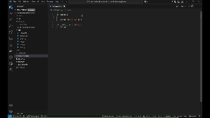

<p>
<div align="center">

</div>
</p>

# Military Commenting (MilComs) 
🚨 Supported Langauges: [ python, rust, cpp, typescript, go ]

## Features
Improves the programming documentation experience. 

This extension enables a commenting style that mirrors some aspects of miltiary weapons system operating manuals. Examples are shown below:

<table>
<tr>
<td></td>
<td></td>
<td></td>
</tr>
</table>

This extension will connect the following words [DANGER, CAUTION, ALERT, SUCCESS, VICTORY, BOOM] with the following emojis: [ ❗, ⚠️, 🚨, ✅, 🏆, 💥]. More will be added in the future. More languages will be added in the future. 

**HOW TO**: Start typing any of the below words & receive a recommended emjoji comment.

❗ DANGER : Indicates an imminent hazard that could cause harm to your model (e.g.: regression vs. classificaion; continuous vs. discrete data).

⚠️ CAUTION : Indicates a potential hazard that could cause harm to your model if approved procedures are not followed (e.g.: epxloding grdient).

🚨 ALERT : Indicates a critical component of the software, e.g. recursion, datatypes, data stream rates, etc. 

✅ SUCCESS : Indicates something good about the model or software!

🏆 VICTORY : Indicates a complete sytsem functionality; better than SUCCESS!

💥 BOOM : Indicates seomthing cool!

```python
# ❗DANGER : 
"""❗DANGER : """

# ⚠️ CAUTION :
"""⚠️ CAUTION :"""

# 🚨 ALERT :
"""🚨 ALERT :"""

# ✅ SUCCESS :
"""✅ SUCCESS :"""

# 🏆 VICTORY :
"""🏆 VICTORY :"""

# 💥 BOOM : 
"""💥 BOOM : """
```
### Animations


## Known Issues
Extension does not work within currently commented lines; extension is not for "active text." Only raw text serves as amedium for the recommendations. 

### Contributing
Contact me or open a pull request. Using TypeScript & compiling to JavaScript. THerefore must use the below command:
```bash
npm run compile
```

**Enjoy!**

<p align="center">

</p>
